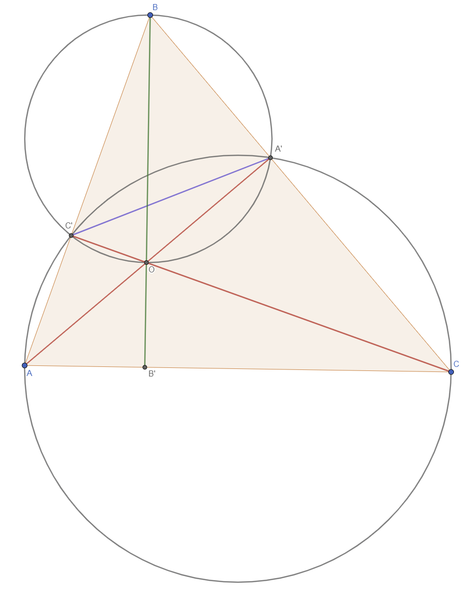
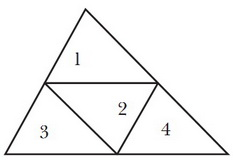
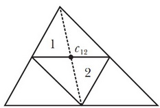
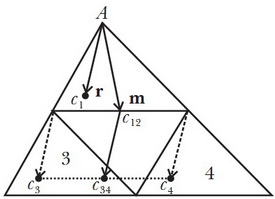
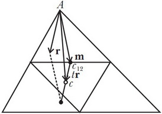

# Билет №1
Замечательные точки треугольника.

## Точка пересечения высот

$$ AA' и CC' - высоты $$
$$ O = AA' \cap CC' $$
$$ B' = BO \cap AC $$

Так как $$ \angle AC'C = \angle AA'C = 90^{\circ} $$, то $$ A, A', C' и C $$ лежат на одной окружности, тогда $$ \angle ACC' = \angle AA'C' $$

Аналогично получаем, что $$ A', O, C', B $$ тоже лежат на одной окружности, значит $$ \angle OBC' = \angle OA'C' \Rightarrow \angle ACC' = \angle OBC' $$

Также из вертикальности углов следует $$ \angle BOC' = \angle COB' \Rightarrow \angle OB'C = \angle OC'B = 90^{\circ} $$

**Аналогичный разбор случая тупого треугольника**

## Центр тяжести
Приведённое ниже доказательство взято с сайта [e-maxx.ru](https://e-maxx.ru/algo/gravity_center#6), материалы, которого выложены под лицензией **Public Domain**.

Приведём здесь элементарное доказательство, не использующее теорию интегралов. 
Доказательство сводится к тому, чтобы показать, что центр масс треугольника лежит на одной из медиан; повторяя
этот процесс ещё дважды, мы тем самым покажем, что центр масс лежит в точке пересечения медиан, которая и есть
центроид.
Разобьём данный треугольник $$ T $$ на четыре, соединив середины сторон, как показано на рисунке:

Четыре получившихся треугольника подобны треугольнику $$ T $$ с коэффициентом $$ \frac{1}{2} $$.
Треугольники №1 и №2 вместе образуют параллелограмм, центр масс которого $$ c_{12} $$ лежит в точке пересечения его
диагоналей (поскольку это фигура, симметричная относительно обеих диагоналей, а, значит, её центр масс обязан
лежать на каждой из двух диагоналей). Точка $$ c_{12} $$ находится посередине общей стороны
треугольников №1 и №2, а также лежит на медиане треугольника $$ T $$:

Пусть теперь вектор $$ \vec{r} $$ -
вектор, проведённый из вершины $$ A $$ к центру масс $$ c_1 $$ треугольника №1,
и пусть вектор $$ \vec{m} $$ — вектор, проведённый из $$ A $$ к точке $$ c_{12} $$ (которая, напомним, является
серединой стороны, на которой она лежит):

Наша цель — показать, что вектора $$ \vec{r} $$ и $$ \vec{m} $$
коллинеарны.
Обозначим через $$ c_3 $$ и $$ c_4 $$ точки, являющиеся
центрами масс треугольников №3 и №4. Тогда, очевидно, центром масс совокупности этих двух треугольников будет
точка $$ c_{34} $$, являющаяся
серединой отрезка $$ c_3 c_4 $$.
Более того, вектор от точки $$ c_{12} $$ к точке $$ c_{34} $$ совпадает с вектором $$ \vec{r} $$.
Искомый центр масс $$ c $$
треугольника $$ T $$ лежит
посередине отрезка, соединяющего точки $$ c_{12} $$ и $$ c_{34} $$ (поскольку мы разбили треугольник
$$ T $$ на две части равных площадей: №1-№2 и №3-№4):

Таким образом, вектор от вершины $$ A $$ к центроиду $$ c $$
равен $$ \vec{m} + \vec{r}/2 $$. С
другой стороны, т.к. треугольник №1 подобен треугольнику $$ T $$ с коэффициентом $$ 1/2 $$, то этот же вектор равен $$ 2 \vec{r} $$. Отсюда получаем
уравнение:

$$  \vec{m} + \vec{r}/2 = 2 \vec{r},  $$
откуда находим:

$$  \vec{r} = \frac{2}{3} \vec{m}.  $$ $$ \vec{r} $$ и $$ \vec{m} $$ коллинеарны, что и означает, что
искомый центроид $$ c $$ лежит на
медиане, исходящей из вершины $$ A $$.
Более того, попутно мы доказали, что центроид делит каждую медиану в отношении $$ 2:1 $$, считая от вершины.


