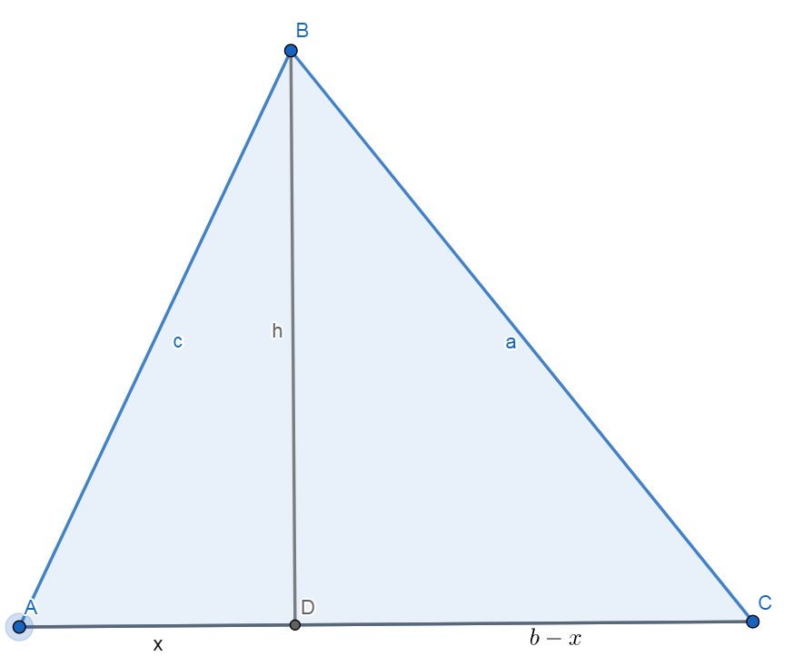

# Билет №14
Площадь многоугольной фигуры. Формулы площади треугольника.

## Герон

Запишем теорему Пифагора:

$$ h^2 = c^2 - x^2 = a^2 - (b - x)^2 $$
$$ (b - 2x)b = a^2 - c^2 $$
$$ b - 2x = \frac{a^2 - c^2}{b} $$
$$ x = \frac{b^2 - a^2 + c^2}{2b} $$

Распишем то выражение:

$$ h^2 = c^2 - x^2 = c^2 - (\frac{b^2 - a^2 + c^2}{2b})^2 =
\frac{2bc - b^2 + a^2 - c^2}{2b} * \frac{2bc + b^2 - a^2 + c^2}{2b} =
\frac{a^2 - (b - c)^2}{2b} * \frac{(b + c)^2 - a^2}{2b} =
\frac{(a + c - b)(a + b - c)(a + b + c)(b + c - a)}{(2b)^2} =
\frac{16 * p(p - a)(p - b)(p - c)}{4b^2} = \frac{4 * p(p - a)(p - b)(p - c)}{b^2} \Rightarrow
h = 2 * \frac{\sqrt{p(p - a)(p - b)(p - c)}}{b} \Rightarrow
S = \frac{b * h}{2} = \sqrt{p(p - a)(p - b)(p - c)} $$


